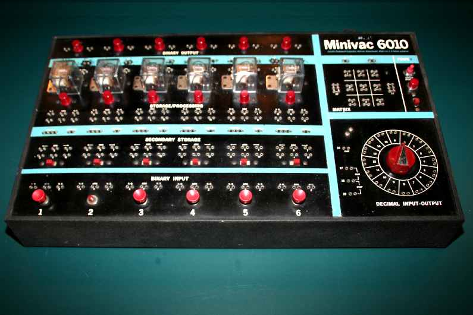

############
Introduction
############

:date: 26 June 2015
:tags: introduction, twc, programming, evolution, math, music, family, economics
:slug: introduction
:category: introduction

**In the beginning** seems too arrogant. I will have more to say about anhedonia later, but this is really the start of everything. I have been programming computers since my best friend Doug Booth was given a `Minivac 6010 <http://oldcomputermuseum.com/minivac_6010.html>`_ "computer". We taught it to play tic-tac-toe (not bad for a couple of ten year old kids), a touchstone for me in every new programming language since.

   The Minivac 6010.

It is not too much to say that Doug's interest in computers created a similar interest in me. I have always been impressionable that way.

Anyway, No Antidote for Anhedonia aims to  be: Occasional thoughts on what the world is, my place in it, programming, economics, family, lots of insects and other inconvenient biology -- the list goes on -- mostly as it applies to my work with `the Working Computer <http://theworkingcomputer.com>`_, a small company devoted to making interesting software that works, and making computers work for people who don't know how computers work.

My name is David Moser. I live with my fiancee (and best friend) and others of our immediate family in southern New Hampshire, a region best known as "somewhere north of Boston".
